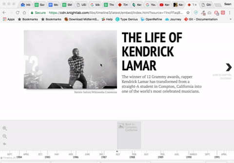
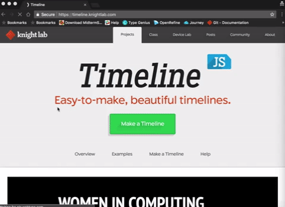
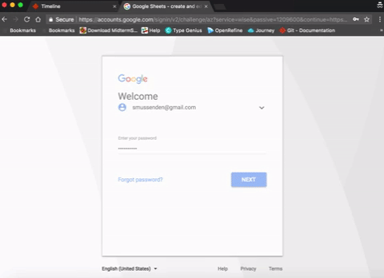
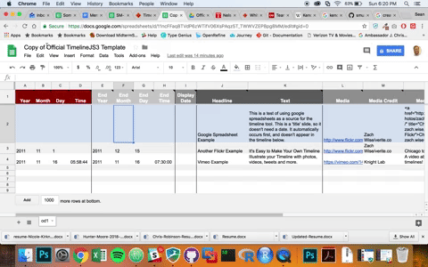
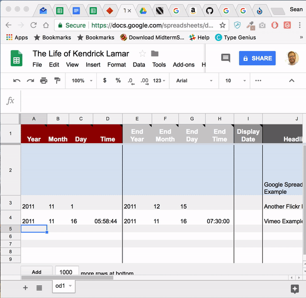
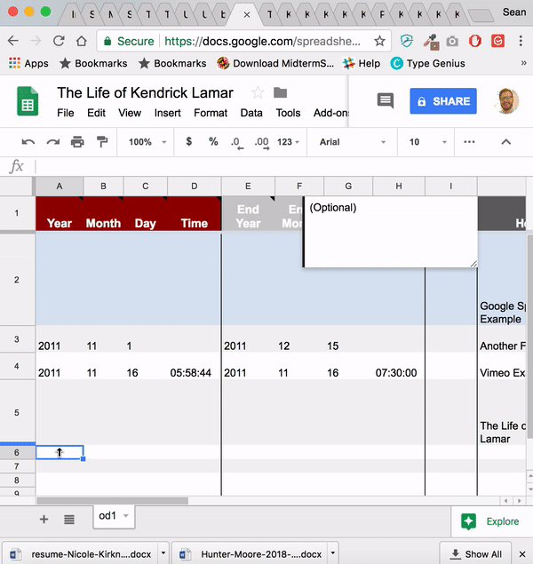
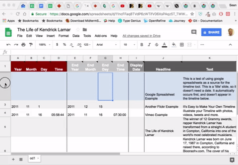
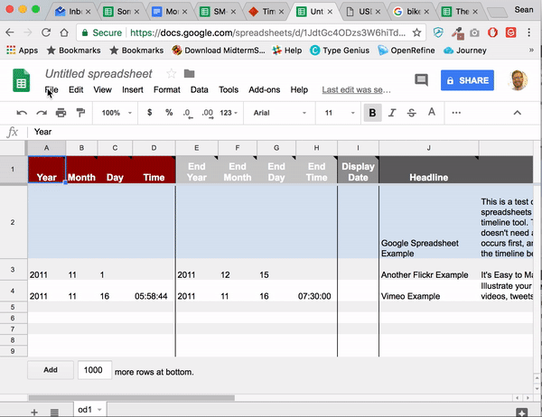

# Tutorial: building a simple interactive timeline with Timeline.js

### What am I doing here?

We're going to build an interactive timeline using the excellent [Timeline.js (website)](https://timeline.knightlab.com/) tool from the Knight Lab.  

Major news organizations like [CNN  (example)](https://www.cnn.com/2016/04/20/asia/north-korea-restaurant-defectors/index.html) and [TIME (example)](http://world.time.com/2013/12/05/nelson-mandelas-extraordinary-life-an-interactive-timeline/) use Timeline.js to tell stories that combine text, tweets, photo and video.  And by the end of this, you will be able to use it to!

In this tutorial, you'll learn to use Timeline.js to build a simple timeline of the life of rapper Kendrick Lamar.  Here it is:

### Why am I doing this?

Timelines are great ways to tell stories that unfold over, well, time, with significant events at key points along the way. A Timeline.js is a pretty simple way to build one.

**Exercise:** Break up into groups of four, and come up with three ideas for stories you could tell using this timeline format?

### What will I need?

* A Google account [(Sign up)](https://accounts.google.com/SignUp?hl=en).
* Access to a computer with Internet access.
* Access to the Timeline.js site, [Timeline.knightlab.com](https://timeline.knightlab.com/).

### What do I need to know before I get started?

You may find it helpful to understand how to work with a spreadsheet in Google Sheets. But even if you don't, I believe that you will figure it out.

### The tutorial

#### Part 1: Getting Started

1. Go to [Timeline.knightlab.com](https://timeline.knightlab.com/) and click the green "Make a Timeline" button.

2. Click the blue "Get the Spreadsheet Template" button.  

3. A new window will open. Log into your Google Account.

4. Click the blue button that says "make a copy".

#### Part 2: Editing the Spreadsheet

All of the information for our timeline will be stored in this spreadsheet, which is organized into rows (the horizontal lines) and columns (the vertical lines), and each bit of information is stored in a box, also known as a "cell". Each row represents one "slide" or "date" on our timeline.

1.  Change the name of the sheet by clicking the words "Copy of Official TimelineJS3 Template" in the upper right corner.  Then type "The Life of Kendrick Lamar".

2.  Take a look at the first row.  Each "cell" in this row contains the name of the column.  Each column contains one type of information -- dates, title text, link to a picture, et cetera. **IMPORTANT: NEVER change the names of these columns. If you do, your timeline won't work!**.

3.  Rows 2, 3 and 4 (look at the numbers on the far right of the sheet) each contain examples.  We'll delete these at the end.

#### Part 3: Creating a title slide.

1.  Look for row number 5, which should be empty. This is where we'll create an introductory slide. Fill out the cells that correspond to the columns in row 5 as follows:

* **Year, Month, Day,	Time,	End Year,	End Month, End Day,	End Time,	Display Date:** *Leave all of these blank.*
* **Headline:** The Life of Kendrick Lamar
* **Text:** The winner of 12 Grammy awards, rapper Kendrick Lamar was once a straight-A student in Compton, California. He has evolved into one of the world's most celebrated musicians.  
* **Media:** https://upload.wikimedia.org/wikipedia/commons/thumb/f/f8/Kendrick_Lamar_3_F.I.B._2016.jpg/1024px-Kendrick_Lamar_3_F.I.B._2016.jpg
* **Media Credit:** 	Batiste Safont/Wikimedia Commons
* **Media Caption, Media Thumbnail:** *Leave these blank*
* **Type:** title
* **Group, Background:** *Leave these blank*

#### Part 4: Creating first timeline entry for Kendrick's birth.

Now that we have a title slide, let's add some notable dates from Kendrick Lamar's life.

1.  Look for row number 6, which should be empty. This is where we'll create a slide for the day Kendrick Lamar was born. Fill out the cells that correspond to the columns in row 6 as follows:  

* **Year:** 1987
* **Month:** 6
* **Day:**	17
* **Time:** *Leave this blank*
* **End Year:** 1987
* **End Month:** 6
* **End Day:**	17
* **End Time:** *Leave this blank*
*	**Display Date:** *Leave this blank*
* **Headline:** Born in Compton, California
* **Text:** Kendrick Lamar Duckworth was born on June 17, 1987 in Compton, California and raised there, according to Biography.com. The cover of his major label debut album -- 2012's "good kid, m.A.A.d city" -- shows Lamar as a young child.     
* **Media:** https://upload.wikimedia.org/wikipedia/en/9/93/KendrickGKMC.jpg
* **Media Credit:** 	album cover/Wikimedia Commons
* **Media Caption, Media Thumbnail:** *Leave these blank*
* **Type:** *Leave this blank*
* **Group, Background:** *Leave these blank*

#### Part 5: Creating second timeline entry for Kendrick's birth.

1. Look for row number 7, which should be empty. This is where we'll create a slide for the release of Kendrick Lamar's first full-length mixtape. Fill out the cells that correspond to the columns in row 7 as follows:  

* **Year:** 2004
* **Month:** *Leave this blank*
* **Day:** *Leave this blank*
* **Time:** *Leave this blank*
* **End Year:** 2004
* **End Month:** *Leave this blank*
* **End Day:**	*Leave this blank*
* **End Time:** *Leave this blank*
*	**Display Date:** 2004
* **Headline:** Releases first full-length mixtape
* **Text:** Performing under the name K-Dot, Kendrick Lamar released his first full-length mixtape "Youngest Head Nigga in Charge (Hub City Threat: Minor of the Year)" in 2004.
* **Media:** https://www.youtube.com/watch?v=_PveJXa5ReI
**Media Credit:** 	album /YouTube
* **Media Caption, Media Thumbnail:** *Leave these blank*
* **Type:** *Leave this blank*
* **Group, Background:** *Leave these blank*

#### Part 6: Delete un-needed example rows.

Now that we have our new entries, delete the un-needed example rows.  

1. Click the row number box for row 2 on the far left side of the screen to highlight the entire row.
2. Hold down control and right-clicking on the mouse while hovering over the row to bring up the drop-down menu.
3. Select "delete row" from the drop-down menu.

4. Repeat for the next two rows.  

#### Part 7: Look at our timeline so-far.

Let's see what our timeline looks like so far.

1.  From the menu at the top of our Google Sheet, select "File".
2.  From the drop-down menu, select "Publish to the web".
3.  Click the blue "Publish" button.

4.  Copy the Google Sheets URL.
5.  Go back to the [Timeline.knightlab.com](https://timeline.knightlab.com/) page.
6.  Scroll down to Step 3, "Generate your timeline"
7.  Paste in your Google Sheet URL in the box.
8.  Scroll down to step 4, "Share your timeline"
9.  Copy the first link in the "Share Link" box.
10. Open a new browser window and paste in your link.
11. There's your timeline!

#### Part 8: Think of more entries to add.

Every time you add a new row to your timeline's Google Sheet, it will create a new entry in the timeline.  

With the group next to you, take a moment to brainstorm ideas for new entries you can add. Some natural ideas:

* A new album release
* Winning a big award
* A significant tour

What else can you think of?

#### Part 9: On your own, add three new entries to your timeline.

Each entry needs:
* a start date and an end date.
* a headline.

Optional:
* a link to an image, a tweet, a YouTube or Vimeo video or other form of media.  

1. Add the information required to the appropriate row and column in the spreadsheet.
2. Go to your timeline and refresh the page.  The new slide should be there.  
